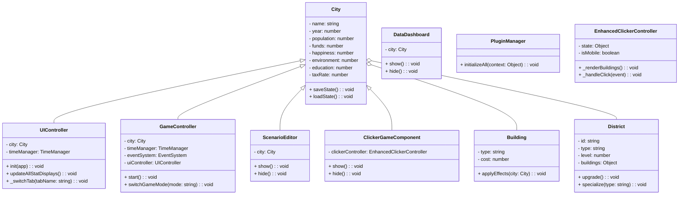

# CitySim - リファクタリング版

本リポジトリは、オリジナルの[CitySim](https://github.com/nao-amj/CitySim)をモジュール化、コード分割し、より保守性が高く拡張しやすい形に再設計したバージョンです。

## 主な改善点

- **モジュラー設計**: 機能ごとにクラスとモジュールに分割
- **クリーンアーキテクチャ**: MVC（Model-View-Controller）パターンの採用
- **拡張性の向上**: 新機能追加がより簡単に
- **データ管理の統一**: 一貫したデータフロー
- **設定とロジックの分離**: ゲームのルールとUI処理の明確な分離
- **エラーハンドリング**: スプライト読み込みやデータ処理の堅牢性向上
- **完全実装**: チュートリアルシステムとクリッカーモードの実装完了

## 新機能

### 地区システム (Districts)
- **複数の地区タイプ**: 住宅地区、商業地区、工業地区、教育地区、環境保全地区
- **地区レベル**: 各地区は最大5レベルまでアップグレード可能
- **地区専門化**: 地区ごとに特殊な専門化を設定可能
- **建物配置**: 各地区内に適切な建物を配置
- **地区イベント**: 地区に関連するランダムイベント

### 統計と可視化
- **時系列データ**: 主要指標（人口、資金、幸福度など）の時系列記録
- **グラフ表示**: Chart.jsを使用した統計情報の視覚化
- **データエクスポート**: 統計データのJSON形式でのエクスポート機能

### 都市マップ
- **グリッドベースマップ**: 10x10のグリッドで都市の空間的配置を表現
- **視覚的表現**: 地区タイプごとに異なる色とアイコンで表示
- **マップ操作**: マップ上での地区作成と管理
- **堅牢なレンダリング**: スプライト読み込み失敗時のフォールバック表示機能

### チュートリアルシステム
- **ステップバイステップガイド**: 初心者向けの段階的なゲーム紹介
- **進行状態の保存**: チュートリアル完了状態をローカルストレージに保存
- **スキップ機能**: 経験者向けのチュートリアルスキップオプション

### クリッカーゲームモード
- **都市アイコンクリック**: クリックで資金を稼ぐシンプルなメカニズム
- **建物購入**: 自動収入を増加させる建物システム
- **アップグレード**: クリック価値や収入を向上させるアップグレード
- **実績システム**: 目標達成による永続的なボーナス効果

## ディレクトリ構造

```
/
├── index.html          # メインHTMLファイル
├── assets/             # 画像、フォントなどの静的アセット
├── styles/             # CSSファイル
├── js/                 # JavaScriptファイル
│   ├── main.js         # アプリケーションのエントリーポイント
│   ├── config/         # ゲーム設定とデータ定義
│   │   ├── GameConfig.js    # 基本ゲーム設定
│   │   └── DistrictsConfig.js # 地区システム設定
│   ├── models/         # データモデル
│   │   ├── City.js     # 都市モデル
│   │   ├── Building.js # 建物モデル
│   │   └── District.js # 地区モデル
│   ├── views/          # UI表示関連
│   │   └── CityMapView.js # 都市マップビュー
│   ├── controllers/    # ビジネスロジック
│   │   ├── GameController.js    # ゲームのメインコントローラー
│   │   ├── UIController.js      # UI操作コントローラー
│   │   ├── TutorialController.js # チュートリアルコントローラー
│   │   └── ClickerController.js  # クリッカーゲームコントローラー
│   ├── services/       # ユーティリティとサービス
│   │   ├── TimeManager.js  # 時間管理
│   │   ├── SaveManager.js  # セーブ管理
│   │   └── EventEmitter.js # イベント発行/購読
│   └── events/         # イベントシステム
│       └── EventSystem.js # ゲーム内イベント管理
└── tests/              # テストファイル（将来的に）
```

## プレイ方法

[https://nao-amj.github.io/CitySim-Refactored](https://nao-amj.github.io/CitySim-Refactored) にアクセスしてプレイできます。

### 基本操作
1. **建設タブ**: 住宅、工場、道路などの基本建物を建設
2. **経済タブ**: 税率設定、経済管理機能
3. **政策タブ**: 次の年へ進む、各種政策設定
4. **地区タブ**: 地区の作成、管理、専門化設定
5. **統計タブ**: 都市の統計データの確認とエクスポート

### 地区管理
1. 地区を作成する: 地区タブから「新しい地区を作成」を選択
2. 地区タイプを選択: 住宅、商業、工業、教育、環境保全から選択
3. 地区内に建物を建設: 地区詳細画面から「建物を建設」を選択
4. 地区をアップグレード: 資金を使って地区のレベルを上げる
5. 専門化の設定: 地区タイプに応じた専門化を選択して効果を得る

### クリッカーモード
1. 「クリッカーモード」ボタンをクリックして切り替え
2. 都市アイコンをクリックして資金を稼ぐ
3. 建物を購入して自動収入を増加
4. アップグレードを購入して収入を強化
5. 実績を達成して永続的なボーナスを獲得

## 最新の改善点（2025年4月）

- **Districtクラスの改善**: 地区設定（DistrictsConfig）との連携強化、専門化機能の修正
- **CityMapViewの強化**: スプライト処理のエラーハンドリングとフォールバック機能の追加
- **TutorialControllerの実装**: チュートリアルステップ管理と状態保存機能
- **ClickerControllerの実装**: クリッカーゲームモードを完全実装

## 機能拡張のしやすさ

本リファクタリング版では、以下のような機能拡張が容易になっています：

1. 新しい建物タイプの追加
2. 新しいイベントの実装
3. 新しい地区タイプや専門化の追加
4. より詳細な都市マップ表現
5. さらなる統計分析機能
6. クリッカーゲームの新しい要素

## 将来的な拡張予定

- 災害シミュレーション機能
- 都市間の貿易システム
- より詳細な経済システム
- 住民の詳細な属性管理
- AIアドバイザー機能
- マルチプレイヤーモード

## クラス図

以下は主要なクラスの構造を示すクラス図です（Mermaid形式）。


## ゲーム仕様書

### 目的
プレイヤーは市長として都市を発展させ、人口・幸福度・環境・教育など複数の指標をバランスよく維持・向上させることを目指します。

### 主な機能
1. **地区システム**: 住宅・商業・工業・教育・環境保全の5タイプを持つ地区を作成・アップグレードし、専門化を設定。
2. **都市マップ**: グリッド状に配置した地区を視覚的に管理。
3. **経済管理**: 税率設定、ローン申請、貿易機能（将来拡張）など。
4. **統計とデータダッシュボード**: 時系列データを記録し、グラフ表示とエクスポートが可能。
5. **シナリオエディタ**: 初期パラメータ（人口、資金、幸福度、環境）を自由に設定し、シナリオをJSON形式で保存。
6. **クリッカーモード**: クリックによる即時収入獲得と、建物・アップグレード購入による自動収入強化を組み合わせたミニゲーム。
7. **プラグイン機構**: `<script data-plugin>` タグで外部プラグインを読み込み、機能拡張が可能。

### コントローラの責務
- `UIController`: 画面表示およびユーザー操作の橋渡し
- `GameController`: ゲーム状態の更新、時間管理、イベント制御
- `ScenarioEditor`/`DataDashboard`: 追加機能としてシナリオ編集・データ可視化を担う
- `ClickerGameComponent`: クリッカーモード切替時の表示と操作ハンドリング
- `PluginManager`: 外部プラグインの登録・初期化

### データ保存
- `SaveManager`: `localStorage` を利用し、都市データとチュートリアル進行状態を自動・手動で保存・復元します。

### 将来拡張ポイント
- オンライン協力/対戦モード
- より高度な経済シミュレーション
- ユーザー作成プラグインのパブリッシュ機能

以上が最新仕様に基づく概要と設計情報です。READMEをご確認ください。

## ライセンス

MIT License

## プラグイン仕様

プラグインの開発と使用方法の詳細は [PLUGIN_SPEC.md](PLUGIN_SPEC.md) をご覧ください。
